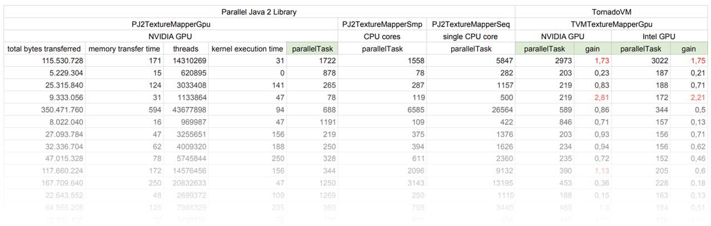

A few years ago I wrote a Java app that creates star maps ([example](https://chartacaeli.org/artistic-star-chart.pdf)). It does this by projecting the coordinates of celestial bodies onto a flat canvas. One of the features is to map images of artistic representations of certain star constellations onto the maps. The approach I took to perform the required calculations turned out to be quite slow.

When I heard about [CUDA](https://developer.nvidia.com/cuda-toolkit) I was excited by the idea of doing computations on graphics cards. I wondered if my slow sequential Java code could be run much faster in parallel on a GPU.

While searching for a CUDA JNI I came across [Alan Kamnisky's](https://www.cs.rit.edu/~ark/) [Parallel Java 2 library](https://www.cs.rit.edu/~ark/pj2.shtml) (PJ2). Alan is a (now retired) professor at the Rochester Institute of Technology. For his lectures he wrote PJ2 and the accompanying book [Big CPU, Big Data](https://www.cs.rit.edu/~ark/bcbd_2/). There were other CUDA JNI implementations at the time (e.g. jCUDA), but I stuck with PJ2 because it also provides APIs for Java parallelization on multiple CPU cores, as well as abstractions for executing code on multiple nodes.

PJ2 made things a lot easier, but there was still a need to write and compile a CUDA kernel. This in turn required learning how to use the necessary tools and APIs in NVIDIA's CUDA Toolkit. I ended up with a somewhat confusing codebase and build system which both are more difficult to maintain than in pure Java. Last but not least, the implementation is tied to NVIDIA. For other, also common accelerators, the learning curve must be gone through again.

## TornadoVM

[TornadoVM](https://www.tornadovm.org) provides a simple API for scheduling Java code to run on popular accelerators (AMD, Intel, NVIDIA) without requiring programmers to leave the Java ecosystem. TornadoVM does all the heavy lifting of preparing and executing Java code on accelerators, including transferring data between host and device.

One question in a parallelization project is _what_ should be parallelized. The answer is most likely _loops_ if it's a single program that's meant to run on a single computer. In general, loops whose iterations work with data that is independent of the data of the other iterations are candidates for parallelization.

However, this comes at a price, because data and code must be transferred to another execution unit (GPU) and the result transferred back from there. The time saved through parallelization must therefore at least compensate for the time required to prepare the GPU, which means that a correspondingly large number of iterations is usually required. Too few iterations may even result in worse execution times overall. However, in that case the candidate may still be suitable for parallel execution on multiple CPU cores instead of a GPU.

Sometimes it is a question of trial and error whether the effort for parallelization is worth it, and the effort should therefore be as low as possible. PJ2 is a great help as it enables parallel execution on multi-core CPUs and NVIDIA GPUs, but the latter of which still requires additional development effort in a different ecosystem. TornadoVM enables GPU programming in Java, not only for NVIDIA, but also for AMD and Intel.

## Porting to TornadoVM

|||
|:---:|:---:|
|||
|||

The approach I took for my app was a) project the edges of a source image (texture) onto a flat canvas (the projection plane), b) find the rectangular bounding box of the distorted result image (mapping), c) project each pixel of the mapping backwards onto the texture, and d) set the mapping pixel to the color of the pixel found in the texture.

Due to distortions caused by projection properties (e.g. stereographic), not every mapping pixel might have a corresponding texture pixel. These pixels are defined as background and colored accordingly.

Source and result images are termed _texture_ and _mapping_ respectively.

Put to Java there is a `class Artwork` to process each indiviual texture. `Artwork` defines several methods for setting things up and uses subclasses to execute my approach on different units (GPUs) by calling the `main` methods of these subclasses.

- `PJ2TextureMapperSeq` executes sequential on a single CPU core.
- `PJ2TextureMapperSmp` executes parallel on available CPU cores.
- `PJ2TextureMapperGpu` executes parallel on a single GPU.

A configuration switch defines which subclass `Artwork` uses to do the mapping.

I kept the overall architecture and just copied the sequential subclass `PJ2TextureMapperSeq` to `TVMTextureMapperGpu` which would become the TornadoVM implementation. Then I adapted the new subclass step by step to the needs of TornadoVM.

All subclasses extend the abstract class `Task` from PJ2 which requires a single method `main` that contains the code supposed for parallel execution. Thus, _adapting TVMTextureMapperGpu_ essentially meant to change the copied code in `TVMTextureMapperGpu::main` for parallel execution by TornadoVM.

A program supposed to execute on a GPU is termed a _kernel_. In TornadoVM, a kernel is a static Java method that TornadoVM prepares and schedules for execution on GPU and whose results it eventually retrieves. This means I had to write a method for the kernel and another to set up TornadoVM to run the kernel on the GPU.

In my original implementation, the `main` methods contain the code intended for parallelization and could therefore be considered kernels. So, in `TVMTextureMapperGpu` I moved the code from `main` into a new static method called `k3rnel` and put the necessary code for preparing and eventually executing `k3rnel` into `main`.

Texture mapping by the subclasses of `Artwork` goes pixel-wise in a nested `for`-loop with control variables for x and y pixels. The [Loop Parallel API](https://tornadovm.readthedocs.io/en/latest/programming.html#loop-parallel-api) of TornadoVM parallelizes `for`-loops by simply adding `@Parallel` annotations.

For this to work, the kernel code in the body of the `for`-loop must use Java primitive types. TornadoVM does not support custom objects or objects from third-party libraries, e.g. Apache Commons Math. The only allowed object types are [those provided by TornadoVM](https://github.com/otabuzzman/TornadoVM/tree/master/tornado-api/src/main/java/uk/ac/manchester/tornado/api/types), mainly matrices, vectors and arrays thereof.

That said, I had to refactor my kernel to use only primitive types and objects instantiated from classes in the TornadoVM API. I turned custom classes as well as classes from third-parties into static methods called by the kernel, and if necessary, provided instance variables as method parameters. This effectively meant copying code from instance methods, which could be a problem with third-party closed-source libraries. Mine are all open source and converting code from instance methods to static ones was mostly a matter of copy and paste.

It turned out that some things were not working with the Loop Parallel API:

- Defining objects outside the body of the `for`-loop and changing their instance variables inside yields runtime errors.

  ```java
  // code fragment to illustrate constraint
  
  static void k3rnel() {
    Float3 st = new Float3( 0, 0, 0 ) ;
  
    for ( @Parallel int i=0 ; i<4 ; i++ ) {
      st.set(0, 1) ; // <--- runtime error
    }
  }
  ```
  **Solve:** Move definition inside `for`-loop.

- Using `return` inside  the `for`-loop body yields runtime errors.
  **Solve:** Refactor code to use `continue`.

- Using cast operators in an expression inside a subscript operator of TornadoVM API yields runtime error "No resources on GPU".
  ```java
  // code fragment to illustrate constraint
  
  static void k3rnel( IntArray texture, IntArray mapping, int dims, int dimo ) {
    for ( @Parallel int t=0 ; t<size ; t++ ) {
      for ( @Parallel int s=0 ; s<size ; s++ ) {
        float o = 4711f ;
        float p = 42f ;
        mapping[t*dims+s] = texture[(int) p*dimo+(int) o] ; // <--- runtime error
      }
    }
  }
  ``` 
  **Solve:** Define propper types to avoid casts.

Kernel handling in terms of preparation and execution happens in `TVMTextureMapperGpu::main` by first setting up a task graph using TornadoVM's `TaskGraph` class. The API takes a string identifier and defines a set of nodes by calling chained methods to a) transfer memory to the GPU, b) schedule the kernel method for execution, and c) pass the results back to Java.

The `TornadoExecutionPlan` class then prepares the task graph for execution, executes it on the GPU and waits for it to complete.

  ```java
  public void main( String[] argv ) throws Exception {
  
    // initialize variables
    // ...

    // define a task graph as sequence of nodes
    TaskGraph taskGraph = new TaskGraph("s0")
    
      // copy buffer(s) from Java to GPU
      .transferToDevice( DataTransferMode.FIRST_EXECUTION, buffer, ... )
    
      // define kernel to execute with parameters
      .task( "t0", Artwork.TVMTextureMapperGpu::k3rnel, param, ... )
    
      // copy result(s) from GPU to Java
      .transferToHost(DataTransferMode.EVERY_EXECUTION, result, ... ) ;
    
    // prepare task graph for execution on GPU
    ImmutableTaskGraph immutableTaskGraph = taskGraph.snapshot() ;
    ornadoExecutionPlan executionPlan = new TornadoExecutionPlan( immutableTaskGraph ) ;
    
    executionPlan.execute() ; // run kernel on GPU

    // process result
    // ...
  }
  ``` 

The `task` method of `TaskGraph` accepts up to 15 parameters that it passes to the kernel method on the GPU. The supported types are Java primitives or the classes provided by the TornadoVM API. The latter contain a number of memory buffers for data exchange between Java and the GPU. Buffers that contain data to be processed by the kernel must be set accordingly before being passed to the task graph. These buffers must be explicitly transferred to the GPU using the `transferToDevice` method of `TaskGraph`. Result buffers that are only written by the GPU do not require a transferToDevice node. Every buffer processed by the GPU must appear in the kernel's parameters. The `transferToHost` method of `TaskGraph` retrieves result buffers from the GPU back to Java.

That was essentially all I did to get a TornadoVM version of my former sequential executing texture mapping method. The [full source](https://github.com/otabuzzman/chartacaeli-app/blob/tornado/org/chartacaeli/Artwork.java) of `Artwork` and its contained new subclass `TVMTextureMapperGpu` are in my [repository on GitHub](https://github.com/otabuzzman/chartacaeli-app). I found using the TornadoVM API rather easy. The key points on [programming with TornadoVM](https://tornadovm.readthedocs.io/en/latest/programming.html) fit on a single fairly short webpage. Reading the many examples provided with TornadoVM was also very helpful.

## Compile with TornadoVM

My app uses Maven to compile and build. I copied [snippets](https://tornadovm.readthedocs.io/en/latest/installation.html#tornadovm-maven-projects) provided by TornadoVM into my [`pom.xml`](https://github.com/otabuzzman/chartacaeli-app/blob/tornado/pom.xml) file to have Maven fetch the necessary JARs needed to compile and build for TornadoVM.

Another tool chain in my setup uses `make` to build with the `javac` compiler. I extended the `-classpath` option of `javac` with the TornadoVM JARs and their dependencies. The exact changes are best looked up in my [`Makefile`](https://github.com/otabuzzman/chartacaeli-app/blob/tornado/Makefile) located in the repository. Compiling the list of JARs was tedious and I would recommend using Maven if possible.

## Execute a TornadoVM app

I used TornadoVM 1.0.3 that I built from source. This is well documented on the [TornadoVM website](https://tornadovm.readthedocs.io/en/latest/installation.html) and works smoothly on Linux, macOS and Windows. Running apps simply requires replacing the `java` command with `tornado`. It sets up an execution environment for TornadoVM and finally executes the `java` command passing it any options not specific to `tornado`.

Because I am on Windows and `tornado` is a Python script I have to prepend the Python interpreter and call `python tornado ...`. This is not necessary on Linux and MacOS.

If I run `tornado` without any special options, the app will run on the default accelerator. On my notebook, this is an NVIDIA graphics card. But there is also an integrated Intel GPU that is suitable for parallel execution, and last but not least, the 8 cores of my CPU. Since I built TornadoVM for all supported accelerators, my app has access to all the execution units in my notebook, which I simply select with a Java property when calling `tornado`.

```bash
python %TORNADO_SDK%\bin\tornado --devices

Number of Tornado drivers: 3
Driver: SPIRV
  Total number of SPIRV devices  : 1
  Tornado device=0:0  (DEFAULT)
    SPIRV -- SPIRV LevelZero - Intel(R) Iris(R) Xe Graphics
            Global Memory Size: 6,3 GB
            Local Memory Size: 64,0 KB
            Workgroup Dimensions: 3
            Total Number of Block Threads: [512]
            Max WorkGroup Configuration: [512, 512, 512]
            Device OpenCL C version:  (LEVEL ZERO)

Driver: OpenCL
  Total number of OpenCL devices  : 3
  Tornado device=1:0
    OPENCL --  [NVIDIA CUDA] -- NVIDIA GeForce RTX 3050 Ti Laptop GPU
            Global Memory Size: 4,0 GB
            Local Memory Size: 48,0 KB
            Workgroup Dimensions: 3
            Total Number of Block Threads: [1024]
            Max WorkGroup Configuration: [1024, 1024, 64]
            Device OpenCL C version: OpenCL C 1.2

  Tornado device=1:1
    OPENCL --  [Intel(R) OpenCL Graphics] -- Intel(R) Iris(R) Xe Graphics
            Global Memory Size: 6,3 GB
            Local Memory Size: 64,0 KB
            Workgroup Dimensions: 3
            Total Number of Block Threads: [512]
            Max WorkGroup Configuration: [512, 512, 512]
            Device OpenCL C version: OpenCL C 1.2

  Tornado device=1:2
    OPENCL --  [Intel(R) OpenCL] -- 11th Gen Intel(R) Core(TM) i5-11320H @ 3.20GHz
            Global Memory Size: 15,8 GB
            Local Memory Size: 32,0 KB
            Workgroup Dimensions: 3
            Total Number of Block Threads: [8192]
            Max WorkGroup Configuration: [8192, 8192, 8192]
            Device OpenCL C version: OpenCL C 3.0

Driver: PTX
  Total number of PTX devices  : 1
  Tornado device=2:0
    PTX -- PTX -- NVIDIA GeForce RTX 3050 Ti Laptop GPU
            Global Memory Size: 4,0 GB
            Local Memory Size: 48,0 KB
            Workgroup Dimensions: 3
            Total Number of Block Threads: [2147483647, 65535, 65535]
            Max WorkGroup Configuration: [1024, 1024, 64]
            Device OpenCL C version: N/A
```

The `tornado --devices` command lists the known devices. To select a specific execution unit of my notebook, I set the device ID from the device list as the value of a property (e.g. `1:0` for the NVIDIA GPU using the OpenCL driver). The name of the property is a dot-concatenation of the string IDs of the task graph (`"s0"`), the task node (`"t0"`), and the `device` literal (e.g. `s0.t0.device` for the code fragment shown above). Put together for my box the command `python tornado --jvm -Ds0.t0.device=1:0 ...` will execute my app on the NVIDIA GPU of my notebook. Using device ID `0:0` will execute on the integrated Intel GPU and `1:2` will use the CPU cores.

Using device `2:0` will fail because my app uses the math function `atan2` which is not supported by the PTX driver. TornadoVM reports the error and runs the kernel on the CPU instead.

## Measured execution times

The table lists the milliseconds that the subclasses took to calculate the images of the example star map. For each subclass, there is a column divided into the accelerators of my notebook. The `parallelTask` column lists the total time it took to execute the `main` method of a subclass.

[](measures.pdf "Click to view PDF")

The `gain` columns to the right of the accelerator columns relate the times of the respective TornadoVM subclass to those of PJ2. The values scatter between faster and slower than PJ2, but all indicate faster execution than on multiple CPU cores. One possible reason for the scatter is the extra time TornadoVM needs to compile the kernel just-in-time from Java code into an executable for the selected accelerator. Another reason could be that some texture mappings are just not _hard enough_ for parallelization with TornadoVM.

Running my app on the Intel accelerator that is also built into my notebook shows similar results to the NVIDIA GPU. I found this interesting because I didn't really had that GPU on my radar. I'm wondering if I could use it in addition to NVIDIA's _main_ GPU by leveraging TornadoVM's [multi-device execution](https://tornadovm.readthedocs.io/en/latest/multi-device.html) feature.
